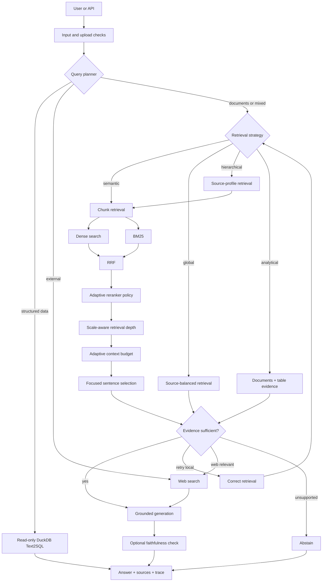

# RAGForge

RAGForge is a retrieval application for asking questions across documents, structured tables, and web sources. It combines local hybrid search with query routing, read-only Text2SQL, optional web research, source-linked answers, and an evaluation suite that exposes how the system reached a result.

The project is designed to make RAG behavior inspectable. The UI shows the selected route, retrieved evidence, context-budget decisions, model calls, and per-node latency instead of presenting only a chat response.

## What it does

A question can be routed to one of several paths:

- **Documents** - dense + BM25 retrieval with reciprocal-rank fusion
- **Data (SQL)** - read-only SQL over uploaded CSV/XLS/XLSX tables in DuckDB
- **Web** - external search when the question genuinely requires current or external information
- **Hybrid** - local evidence plus web evidence when both are needed
- **Overview / analysis** - source-balanced retrieval for corpus summaries and analytical synthesis

The default `Auto` route uses a structured planner to decide the knowledge scope, task type, retrieval strategy, and whether web access is relevant.

## Retrieval and context handling

The document path uses:

- FastEmbed dense embeddings with embedded Qdrant
- BM25 lexical retrieval
- reciprocal-rank fusion
- source-profile retrieval for source-first and corpus-wide queries
- an adaptive cross-encoder policy rather than always paying reranking cost
- retrieval depth that grows with corpus size
- a focused context budget that retains more evidence when retrieval is ambiguous
- local sentence selection for focused lookups before the evidence is sent to the generation model

Broad overview, comparison, and insight queries keep wider context. Focused lookups can use a smaller evidence set when the retrieval signal is clear.

Source cards always keep the original retrieved text. Context compression only changes the copy passed to generation.

## Grounding and citations

Generated answers refer back to the source cards returned with the response. Document, structured-table, and web evidence use separate source identifiers so the UI can distinguish where a claim came from.

The pipeline also includes:

- citation normalization and conservative local repair
- evidence sufficiency checks
- calibrated handling of information that is absent from the corpus
- optional corrective retrieval
- optional bounded faithfulness revision
- a full execution trace for each answer

## Structured data

CSV, XLS, and XLSX files are indexed for retrieval and also loaded into an isolated in-memory DuckDB database.

The Text2SQL path:

1. generates a single query,
2. validates that it is read-only,
3. blocks mutation and administrative statements,
4. applies row limits,
5. executes the query in DuckDB, and
6. returns the resulting scalar or table.

The benchmark evaluates the computed values directly instead of relying on how a table happens to be rendered as text.

## Web research

RAGForge can use DuckDuckGo, Tavily, or Gemini Search. Web search is planned separately from local retrieval, and allowing web fallback is not the same thing as deciding that the web is relevant.

This matters for private/local questions: weak document retrieval by itself does not cause the query to be sent to the internet.

## Supported files

PDF, TXT, Markdown, DOCX, PPTX, CSV, XLS/XLSX, JSON, HTML, XML/YAML, common code/text formats, images, and ZIP archives are supported.

ZIP ingestion includes path-traversal, file-count, size, and extension checks. Optional Gemini OCR can be enabled for scanned PDFs and images.

## Architecture



The full architecture diagram is in [`docs/architecture.mmd`](docs/architecture.mmd).

## Evaluation

The Evaluation tab runs a transparent benchmark stored in [`evals/demo_benchmark.json`](evals/demo_benchmark.json). The goal is to diagnose specific parts of the system rather than to claim a general RAG accuracy score.

### Quick

A small deployment smoke test covering a subset of QA, routing, overview, SQL, robustness, and abstention cases. It intentionally does **not** run the larger context, compression, or scale-stress ablations.

### Standard

Runs the full deterministic suite:

- focused QA
- route / task / retrieval-strategy planning
- corpus overview
- Text2SQL
- abstention
- robustness cases
- retrieval and reranker ablation
- context-budget comparison
- sentence-compression comparison
- node latency
- synthetic distractor scale stress

### Deep

Reuses a compatible Standard result when possible and adds a small LLM-judge sample for answer faithfulness, relevance, completeness, and citation support.

### Interpreting the benchmark

The bundled benchmark is intentionally small: five source files, one structured table, and a 90-chunk base corpus. It is useful for regression testing and for comparing design choices, not for making claims about general enterprise performance.

The scale-stress harness expands the retrieval index with deterministic distractor copies so retrieval behavior can be checked at a larger index size without spending additional model calls. That is still a synthetic stress test, not a substitute for a real large-corpus evaluation.

During the final v2.0 acceptance run, the evaluation suite exposed a useful benchmark bug: one generated Sev-1 answer said `15 minutes` even though the source says `5 minutes`, and the old answer matcher incorrectly accepted it because `5 min` appeared inside `15 minutes`. v2.0.1 fixes answer matching at token/phrase boundaries and changes the benchmark version so older saved results are not silently reused.

Context-budget and compression tables should likewise be read as engineering comparisons: they show how much evidence reached generation and whether labeled answer evidence was retained on this benchmark. They are not general claims that a fixed percentage of tokens can always be removed safely.

See [`docs/FINAL_RESULTS.md`](docs/FINAL_RESULTS.md) for the detailed validation notes and caveats.

## Running the project

### Hugging Face Spaces

1. Create a Docker Space.
2. Copy the repository into the Space root.
3. Add `GEMINI_API_KEY` under **Settings -> Secrets**.
4. Optionally add `TAVILY_API_KEY` and `APP_API_TOKEN`.
5. Push the repository.
6. Open the Space and leave **Use bundled demo files** enabled for the demo corpus.
7. Start with `Auto` + `Balanced`.

The demo corpus can be indexed explicitly or initialized lazily on the first local question.

### Local Docker

```bash
cp .env.example .env
# add GEMINI_API_KEY to .env

docker build -t ragforge .
docker run --rm -p 7860:7860 --env-file .env ragforge
```

Open `http://localhost:7860`.

### Development

```bash
python -m pip install -r requirements-dev.txt
make verify
make run
```

`make verify` runs linting, tests, Python compilation, and release-consistency checks.

## Suggested demo questions

```text
What is the Sev-1 acknowledgement target?
```

Focused document retrieval with a short cited answer.

```text
What is the collection about?
```

Corpus-wide source-balanced retrieval, including the structured support table.

```text
What exactly does this collection reveal? Identify important trends and caveats.
```

Analytical synthesis across documents and structured data.

```text
Which support tier has the shortest first-response SLA?
```

Routes to the read-only Text2SQL path.

```text
Compare our NIST document with the latest NIST AI risk guidance online.
```

Demonstrates the mixed local + web route.

## REST API

FastAPI exposes Swagger at `/docs` and OpenAPI at `/openapi.json`.

Common endpoints:

```text
GET   /api/health
GET   /api/v1/info
POST  /api/v1/session
GET   /api/v1/session/{session_id}
GET   /api/v1/session/{session_id}/diagnostics
POST  /api/v1/ingest
POST  /api/v1/query
POST  /api/v1/evaluate/demo
GET   /api/v1/evaluation/benchmark
GET   /api/v1/evaluation/saved/{session_id}
GET   /api/v1/evaluation/history/{session_id}
GET   /metrics
```

Example query:

```bash
curl -X POST "$BASE_URL/api/v1/query" \
  -H "Content-Type: application/json" \
  -d '{
    "session_id": "YOUR_SESSION_ID",
    "query": "What is the collection about?",
    "config": {"mode": "Auto", "profile": "Balanced"}
  }'
```

See [`docs/ARCHITECTURE_API.md`](docs/ARCHITECTURE_API.md) for the complete API notes.

## Security and limitations

RAGForge includes controls for archive ingestion, retrieved prompt injection, SQL safety, session isolation, secrets, rate limiting, and web-fetch URL checks. It is not a compliance-certified multi-tenant service.

Important limitations:

- workspace, vector, and SQL state are process-local and ephemeral on a standard Hugging Face Space
- browser persistence stores an opaque workspace ID, not durable server state
- prompt-injection detection is heuristic
- trace token counts are engineering estimates, not provider billing records
- the bundled benchmark is a regression suite over a small demo corpus
- the larger scale result uses synthetic distractors rather than a real enterprise dataset
- production multi-tenant deployment would require durable storage, stronger tenant isolation, external database/vector infrastructure, and stricter network controls

See [`SECURITY.md`](SECURITY.md).

## Repository layout

```text
src/ragforge/
  pipeline.py              pipeline orchestration
  llm.py                   Gemini planning and generation
  retrieval.py             dense + BM25 + RRF + reranking
  context_budget.py        adaptive retrieval/context policy
  evidence_compression.py  focused sentence selection
  workspace.py             sessions, indexes, SQL, evaluation history
  evaluation.py            benchmark and diagnostics
  stress_eval.py           local synthetic scale-stress harness
  sql_agent.py             read-only Text2SQL
  web_search.py            external search path
  security.py              ingestion/query/web checks
  ui.py                    Gradio application
  api.py                   FastAPI API

evals/
  demo_benchmark.json

docs/
  FINAL_RESULTS.md
  PORTFOLIO_GUIDE.md
  EVALUATION.md
  ARCHITECTURE_API.md
  FEATURE_MATRIX.md
  QUERY_PLANNING.md
  UX_LIFECYCLE.md
```

Development history is kept in [`CHANGELOG.md`](CHANGELOG.md); it is intentionally separate from the main product documentation.

## License

See [`LICENSE`](LICENSE).
